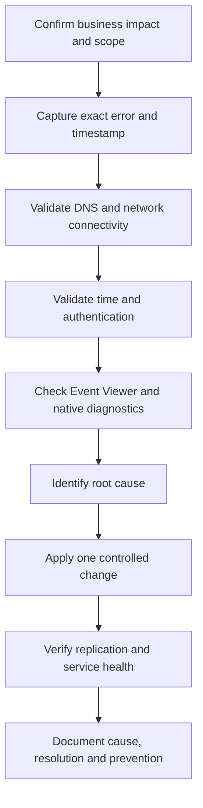

<div align="center">

# 🛡️ Active Directory Troubleshooting

### Practical diagnostics, root-cause analysis, PowerShell tools, labs, and recovery guidance for Windows Server administrators

[](https://learn.microsoft.com/windows-server/)
[](https://learn.microsoft.com/windows-server/identity/ad-ds/)
[](https://learn.microsoft.com/powershell/)
[](docs/SCENARIO-INDEX.md)
[](docs/SCENARIO-INDEX.md)
[](LICENSE)

</div>

---

## 📌 About This Repository

This repository is a practical Active Directory troubleshooting knowledge base for:

- System Administrators
- Infrastructure Engineers
- IT Support L2/L3 teams
- Helpdesk engineers moving into Windows Server administration
- Students building enterprise lab experience

The documentation uses a consistent operational method:

> **Symptoms → Business impact → Root cause → Diagnostics → Resolution → Verification → Prevention**

> [!IMPORTANT]
> The commands and scripts in this repository are intended for lab environments and authorized administration. Review every command, maintain verified backups, and follow formal change management before production use.

---

## 📊 Current Progress

| Deliverable | Status |
|---|---:|
| Troubleshooting scenarios published | **30 / 50** |
| Foundation and contribution files | ✅ Complete |
| PowerShell diagnostic toolkit | 🚧 In progress |
| Scenario index and navigation | ✅ Complete |
| Labs and diagrams | 🚧 In progress |
| Markdown validation workflow | Planned |

Open the complete tracker: **[Scenario Index](docs/SCENARIO-INDEX.md)**

---

## 🚨 Troubleshooting Coverage

| Area | Examples |
|---|---|
| Domain Controllers | Boot failure, promotion failure, Global Catalog, RODC |
| Authentication | Kerberos, NTLM, clock skew, SPNs, secure channel |
| Replication | Error 1722, error 8453, lingering objects, tombstone lifetime |
| DNS | Missing SRV records, scavenging, dynamic updates, DC Locator |
| Group Policy | Access denied, WMI filters, loopback, replication delay |
| SYSVOL / DFSR | Missing shares, Event 2213, backlog, initialization |
| FSMO | Role-holder failure, RID pool, PDC time hierarchy |
| Directory Database | NTDS.dit growth, integrity, offline maintenance |
| LDAP | Timeouts, signing, channel binding, expensive queries |
| Recovery | AD Recycle Bin, authoritative restore, snapshot rollback |
| Performance | LSASS high CPU, LDAP load, replication backlog |
| Security | Account lockouts, delegation, stale objects, auditing |

---

## 🧭 Published Scenarios

### AD-001 to AD-010

- [AD-001 — Domain Controller will not boot](docs/scenarios/AD-001-Domain-Controller-Wont-Boot.md)
- [AD-002 — Kerberos logon failures](docs/scenarios/AD-002-Kerberos-Logon-Failures.md)
- [AD-003 — Active Directory replication failures](docs/scenarios/AD-003-AD-Replication-Failures.md)
- [AD-004 to AD-008 — Core services](docs/scenarios/AD-004-to-AD-008-Core-Services.md)
- [AD-009 to AD-012 — Database, LDAP and security](docs/scenarios/AD-009-to-AD-012-Database-LDAP-Security.md)

### AD-011 to AD-020

- [AD-013 to AD-016 — Time, recovery, performance and promotion](docs/scenarios/AD-013-to-AD-016-Time-Recovery-Performance-Promotion.md)
- [AD-017 to AD-020 — Policy, RPC, DC Locator and lingering objects](docs/scenarios/AD-017-to-AD-020-Policy-RPC-Locator-Lingering.md)

### AD-021 to AD-030

- [AD-021 to AD-025 — SYSVOL, DFSR, SPN, time and DNS](docs/scenarios/AD-021-to-AD-025-SYSVOL-SPN-Time-DNS.md)
- [AD-026 to AD-030 — Replication and Group Policy](docs/scenarios/AD-026-to-AD-030-Replication-and-Group-Policy.md)

---

## 🧰 PowerShell Toolkit

| Script | Purpose |
|---|---|
| [`Invoke-ADHealthCheck.ps1`](scripts/health-check/Invoke-ADHealthCheck.ps1) | General Active Directory health assessment |
| [`Get-ADTimeHealth.ps1`](scripts/health-check/Get-ADTimeHealth.ps1) | Report DC time sources and hierarchy |
| [`Find-DuplicateSPN.ps1`](scripts/kerberos/Find-DuplicateSPN.ps1) | Find duplicate Service Principal Names |
| [`Get-DnsAgingReport.ps1`](scripts/dns/Get-DnsAgingReport.ps1) | Report DNS aging, scavenging and record counts |
| [`Test-ADReplication.ps1`](scripts/replication/Test-ADReplication.ps1) | Report inbound replication health across DCs |

Example:

```powershell
Set-ExecutionPolicy -Scope Process Bypass

.\scripts\health-check\Invoke-ADHealthCheck.ps1
.\scripts\health-check\Get-ADTimeHealth.ps1 -ExportPath C:\Temp\AD-Time.csv
.\scripts\kerberos\Find-DuplicateSPN.ps1 -ExportPath C:\Temp\Duplicate-SPNs.csv
.\scripts\dns\Get-DnsAgingReport.ps1 -DnsServer DC01 -ExportPath C:\Temp\DNS-Aging.csv
.\scripts\replication\Test-ADReplication.ps1 -ExportPath C:\Temp\Replication.csv
```

> [!CAUTION]
> A reporting script can reveal a problem but should not automatically perform destructive remediation. Review findings and validate the root cause before changing AD, DNS, SYSVOL, SPNs or replication settings.

---

## 🔧 Essential Native Tools

```powershell
# Domain Controller health
dcdiag /v

# Replication summary and failures
repadmin /replsummary
repadmin /showrepl * /errorsonly

# Domain Controller discovery
nltest /dsgetdc:contoso.com

# Secure channel
Test-ComputerSecureChannel -Verbose

# SYSVOL and NETLOGON
net share

# Group Policy results
gpresult /h C:\Temp\GPReport.html

# Kerberos tickets and SPNs
klist
setspn -X

# DNS SRV records
nslookup -type=SRV _ldap._tcp.dc._msdcs.contoso.com

# Time hierarchy
w32tm /monitor
```

---

## 🧠 Standard Troubleshooting Workflow



1. Confirm the affected users, computers, sites and services.
2. Capture exact errors, event IDs and timestamps.
3. Check DNS before changing Active Directory.
4. Validate time synchronization and network connectivity.
5. Review client and Domain Controller event logs.
6. Use native tools before applying changes.
7. Change one variable at a time.
8. Verify AD replication, DNS, SYSVOL and authentication afterward.
9. Document the root cause and prevention measures.

---

## 🧪 Recommended Lab

| Component | Suggested configuration |
|---|---|
| Hypervisor | Hyper-V, VMware Workstation, or VirtualBox |
| Domain Controllers | Two Windows Server VMs |
| Client | One Windows 11 VM |
| Domain | `corp.contoso.local` or another lab-only namespace |
| Sites | HQ and Branch |
| Services | AD DS, DNS, DHCP, Group Policy, DFSR |
| Optional | Windows Admin Center, RSAT, Wireshark |

Never use production credentials, company domain names or sensitive data in a public lab.

---

## 🗂️ Repository Structure

```text
Active-Directory-Troubleshooting/
├── docs/
│   ├── scenarios/
│   ├── SCENARIO-INDEX.md
│   └── TROUBLESHOOTING-TEMPLATE.md
├── scripts/
│   ├── health-check/
│   ├── replication/
│   ├── dns/
│   ├── kerberos/
│   └── reporting/
├── labs/
├── diagrams/
├── cheatsheets/
├── CONTRIBUTING.md
├── LICENSE
└── README.md
```

---

## 🗺️ Roadmap

- [x] Repository foundation
- [x] Standard troubleshooting template
- [x] Publish AD-001 through AD-020
- [x] Publish AD-021 through AD-030
- [x] Add initial PowerShell reporting toolkit
- [ ] Publish AD-031 through AD-040
- [ ] Publish AD-041 through AD-050
- [ ] Add hands-on lab guides
- [ ] Add authentication and replication diagrams
- [ ] Add downloadable cheat sheets
- [ ] Add automated Markdown and PowerShell validation
- [ ] Expand toward 100+ scenarios

---

## 🤝 Contributing

Corrections, scripts, lab screenshots and real-world troubleshooting examples are welcome. Read [`CONTRIBUTING.md`](CONTRIBUTING.md) before opening a pull request.

---

## 👨‍💻 Author

**Xuan Toan Nguyen**  
Systems Administrator & ICT Support Professional  
Adelaide, South Australia

[](https://www.linkedin.com/in/toan-nguyen-it-oz)
[](https://github.com/toannguyenitoz)

---

<div align="center">

⭐ Star the repository if it supports your Windows Server learning journey.

[Scenario Index](docs/SCENARIO-INDEX.md) · [Contributing](CONTRIBUTING.md) · [Back to top](#️-active-directory-troubleshooting)

</div>
