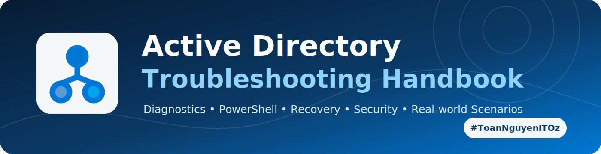
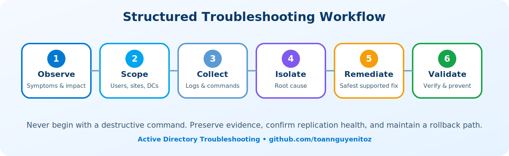

<p align="center"></p>

<p align="center">


</p>

# 🔄 AD-003 — Active Directory Replication Failures

> [!CAUTION]
> Do not force replication from a DC reporting Event 2042 or suspected lingering objects until tombstone-lifetime and data-authority risks are assessed.

## 🧭 Quick navigation
[Overview](#-overview) · [Symptoms](#-symptoms) · [Causes](#-likely-causes) · [Diagnosis](#-diagnostic-workflow) · [Resolution](#-resolution) · [Verification](#-verification) · [Prevention](#-prevention)

<p align="center"></p>

## 📖 Overview
AD replication keeps directory partitions consistent across domain controllers. Failures can cause stale passwords, missing users and groups, inconsistent GPOs, authentication failures, and unreliable disaster recovery.

## 🚨 Symptoms
- `repadmin /replsummary` reports failures.
- Changes appear on one DC but not another.
- Event IDs 1311, 1566, 1865, 1925, 2042, or 2087 appear.
- Password changes work against one DC only.
- DNS, SYSVOL, or Global Catalog data becomes inconsistent.

## 🧩 Likely causes
DNS misconfiguration, blocked RPC, broken site topology, time skew, authentication failure, lingering objects, tombstone lifetime exceeded, or a failed DC that was not cleaned up.

## 🔎 Diagnostic workflow
```cmd
repadmin /replsummary
repadmin /showrepl * /csv > showrepl.csv
repadmin /queue
repadmin /bridgeheads
repadmin /kcc *
dcdiag /test:replications /v
```

Confirm DC DNS settings point only to internal AD DNS servers. Test connectivity:

```powershell
Test-NetConnection dc02 -Port 135
Resolve-DnsName _ldap._tcp.dc._msdcs.contoso.com -Type SRV
```

Review **Directory Service**, **DFS Replication**, **DNS Server**, and **System** logs. Identify the earliest root error rather than treating every downstream symptom independently.

### 🧪 Error-oriented triage

| Error/Event | Typical direction |
|---|---|
| 1722 | RPC, firewall, routing, DNS |
| 5 / 8453 | Permissions or replication access denied |
| 8524 | DNS lookup failure |
| 2042 | Tombstone lifetime exceeded |
| 1988 | Lingering object detected |
| 1311 / 1865 | Site topology or KCC path problem |

## 🛠️ Resolution
- Correct DNS client settings and stale records.
- Restore RPC/firewall connectivity, including TCP 135 and the approved dynamic RPC range.
- Correct site, subnet, site-link, bridgehead, or KCC configuration.
- Force topology recalculation only after the root cause is fixed:
```cmd
repadmin /kcc dc01
repadmin /syncall /AdeP
```
- Remove metadata for permanently failed DCs.
- Use advisory mode before lingering-object removal.

## ✅ Verification
```cmd
repadmin /replsummary
repadmin /showrepl
dcdiag /test:replications
```
Create a temporary test object and confirm it appears on all writable DCs. Validate all naming contexts, not only the domain partition.

## 🛡️ Prevention
Monitor replication daily, define sites and subnets correctly, keep DNS healthy, alert on long replication gaps, avoid unsupported snapshot rollback, and maintain tested System State backups.

## 🔗 Related scenarios
- [AD-004 — Missing DNS SRV Records](AD-004-to-AD-008-Core-Services.md#ad-004--missing-dns-srv-records)
- [AD-007 — SYSVOL Not Replicating](AD-004-to-AD-008-Core-Services.md#ad-007--sysvol-not-replicating-with-dfsr)
- [AD-020 — Lingering Objects](AD-017-to-AD-020-Policy-RPC-Locator-Lingering.md#ad-020--lingering-objects-after-restore)

---
<p align="center"><a href="../SCENARIO-INDEX.md"><b>📚 Scenario Index</b></a> · <a href="../../README.md"><b>🏠 Repository Home</b></a> · <a href="#top"><b>⬆️ Back to Top</b></a></p>
<p align="center"><b>Author: Xuan Toan Nguyen</b><br>Systems Administration &amp; IT Support • Adelaide, South Australia<br><a href="https://github.com/toannguyenitoz">GitHub</a> · <a href="https://www.linkedin.com/in/toan-nguyen-it-oz">LinkedIn</a></p>
<p align="center"><sub>⭐ Star the repository if this guide helps your troubleshooting. • #ToanNguyenITOz</sub></p>